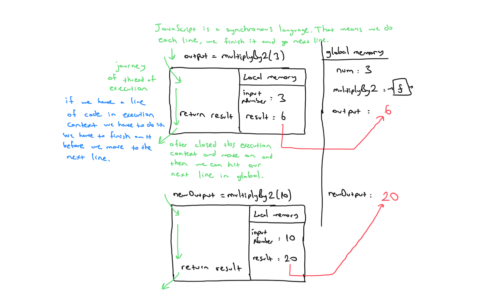
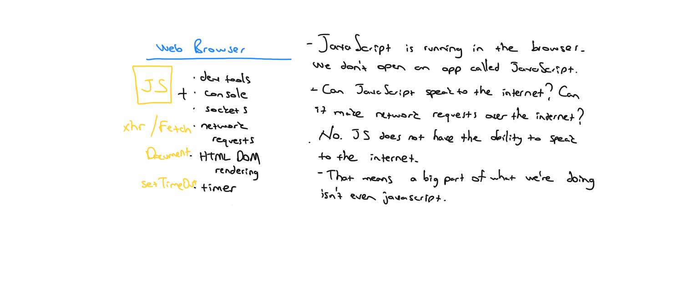
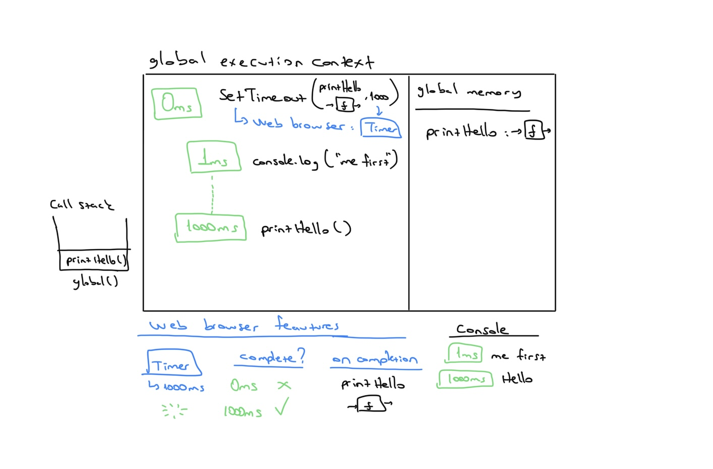

# Synchronous and Asynchronous


## Table of contents
* [A reminder of how JavaScript executes code](#a-reminder-of-how-javascript-executes-code)
* [Synchronous JavaScript](#synchronous-javascript)
* [Asynchronous JavaScript](#asynchronous-javascript)
* [Resources](#resources)


JavaScript is a single-threaded, non-blocking, asynchronous, concurrent language. It has a call stack, an event loop, a callback queue, some other apis and stuff.

JavaScript is a single-threaded programming language, single-threaded runtime, it has a single call-stack. It can do one thing at a time. That's what a single treaded means. 

## A reminder of how JavaScript executes code

```js
const num = 3;
function multiplyBy2 (inputNumber){
 const result = inputNumber*2;
 return result;
}
const output = multiplyBy2(num);
const newOutput = multiplyBy2(10);
```



**Asynchronicity is the backbone of modern web development in JavaScript yet...**

JavaScript is:

- Single threaded (one command runs at a time)
- Synchronously executed (each line is run in order the code appears)

So what if we have a task:

- Accessing Twitter’s server to get new tweets that takes a long time 
- Code we want to run using those tweets

Challenge: We want to wait for the tweets to be stored in tweets so that they’re there to run displayTweets on - but no code can run in the meantime

**Slow function blocks further code running**

```js
const tweets = getTweets("http://twitter.com/will/1")

// ⛔350ms wait while a request is sent to Twitter HQ displayTweets(tweets)

// more code to run

console.log("I want to runnnn!")
```

**What if we try to delay a function directly using setTimeout?**
setTimeout is a built in function - its first argument is the function to delay followed by ms to delay by

```js
function printHello(){
    console.log("Hello");
}
setTimeout(printHello,1000);
console.log("Me first!"); 
```

In what order will our console logs appear?

So what about a delay of 0ms
Now, in what order will our console logs occur?

```js
function printHello(){
    console.log("Hello");
}
setTimeout(printHello,0);
console.log("Me first!");
```

JavaScript is not enough - We need new pieces (some of which aren’t JavaScript at all)

Our core JavaScript engine has 3 main parts:

- Thread of execution
- Memory/variable environment
- Call stack

We need to add some new components:

- Web Browser APIs/Node background APIs
- Promises
- Event loop, Callback/Task queue and micro task queue



**ES5 solution: Introducing ‘callback functions’, and Web Browser APIs**

**Example**

```js
function printHello(){ console.log("Hello"); }
setTimeout(printHello,1000);
console.log("Me first!");
```



**Example**

```js
function printHello(){ console.log("Hello"); }
function blockFor1Sec(){ 
    //blocks in the JavaScript thread for1 sec
}
setTimeout(printHello,0);
blockFor1Sec()
console.log("Me first!");
```


## Synchronous JavaScript

As the name suggests synchronous means to be in a sequence, i.e. every statement of the code gets executed one by one. So, basically a statement has to wait for the earlier statement to get executed.

## Asynchronous JavaScript

Asynchronous code allows the program to be executed immediately where the synchronous code will block further execution of the remaining code until it finishes the current one. This may not look like a big problem but when you see it in a bigger picture you realize that it may lead to delaying the User Interface.

## Resources:
* https://adrianmejia.com/
* https://www.geeksforgeeks.org/
* What the heck is the event loop anyway ? Philip Roberts [Watch on youtube](https://www.youtube.com/watch?v=8aGhZQkoFbQ&list=LL&index=1)