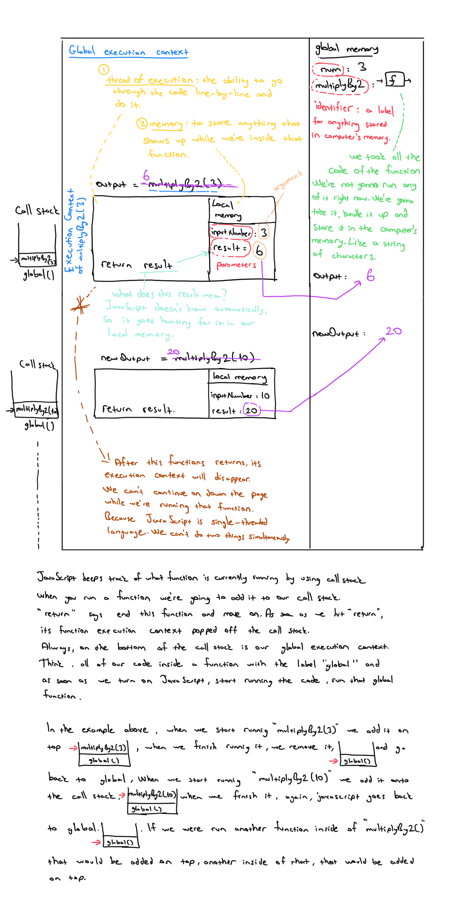
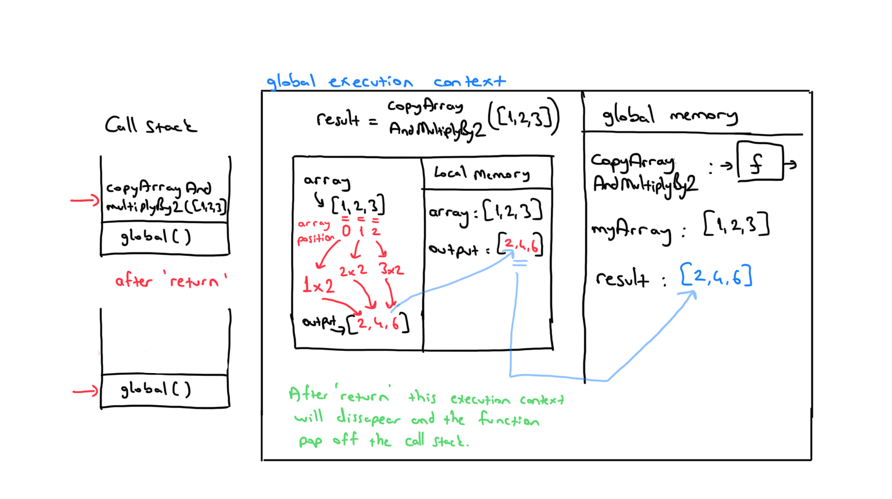
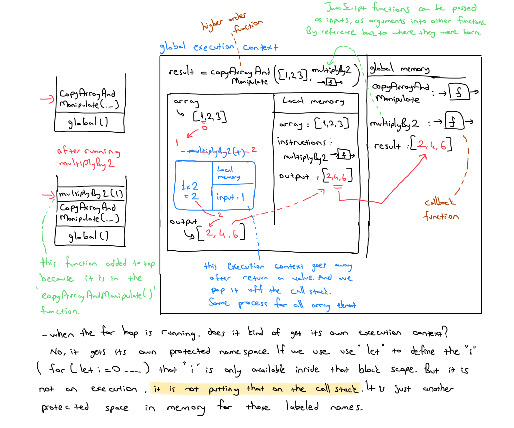

# Execution Context

## Table of contents
* [How does code actually run in JavaScript ?](#how-does-code-actually-run-in-javascript)
  - [Example-1](#example-1)
* [Why do we need functions ?](#why-do-we-need-functions)
  - [Example-2](#example-2)
* [Resources](#resources)

## How does code actually run in JavaScript

JavaScript does two things, first, goes through the code line-by-line and runs (executes) each line - known as the thread of execution. Second, saves ‘data’ like strings and arrays so we can use that data later - in its memory.
We can even save code (‘functions’).

**Functions**

Code we save (‘define’) functions & can use (call/invoke/execute/run) later with the function’s name with ().

**Execution context**

Created to run the code of a function - has 2 parts
- Thread of execution 
- Memory

### Example-1

```js
const num = 3;
function multiplyBy2 (inputNumber){
 const result = inputNumber*2;
 return result;
}
const output = multiplyBy2(num);   // it's a function call
const newOutput = multiplyBy2(10); // it's a function call
```



## Why do we need functions

Let's create a function for 10 squared

```js
function tenSquared() {
   return 10*10;
}
tenSquared() // 100
```

Now 9 squared

```js
function nineSquared() {
   return 9*9;
}
tenSquared() // 100
```

What about a 8 squared function ? 

```js
function eightSquared() {
   return 8*8;
}
tenSquared() // 100
```

<ins>All codes here are broken DRY (don't repeat yoursel) princible.</ins> We don't want to rewriting code when we don't have to. Because its gets much harder to track and maintain what we are doing. Here we can generalize the function to make it resusable,

```js
function squareNum(num){
    return num*num;
}
squareNum(10); // 100
squareNum(9); // 81
squareNum(8); // 64
```

‘Parameters’ (placeholders) mean we don’t need to decide what data to run our functionality on until we run the function
- Then provide an actual value (‘argument’) when we run the function 
- We may not want to decide exactly what some of our functionality is until we run our function. Higher order functions follow this same principle.

### Example-2

Think about this function

```js
function copyArrayAndMultiplyBy2(array) {
   const output = [];
   for (let i = 0; i < array.length; i++) {
     output.push(array[i] * 2);
   }
   return output;
 }
const myArray = [1,2,3];
const result = copyArrayAndMultiplyBy2(myArray);
```



Is this function below is same with the function above ? No they are different. There is just one difference, one character but it's still different. So should I do all the things above again ? 

```js
function copyArrayAndDivideBy2(array) {
   const output = [];
   for (let i = 0; i < array.length; i++) {
     output.push(array[i] / 2);
   }
   return output;
 }
const myArray = [1,2,3];
const result = copyArrayAndDivideBy2(myArray);
```

Or for this function below ? 

```js
function copyArrayAndAdd3(array) {
   const output = [];
   for (let i = 0; i < array.length; i++) {
     output.push(array[i] + 3);
   }
   return output;
 }
const myArray = [1,2,3];
const result = copyArrayAndAdd3(myArray);
```

Again, we are breaking DRY princible. We could pass functionality as a parameter. Like we passed values as a parameter in the squared functions above. Here, we could leave some of our functionality, we could write these functions once leave it in a blank where the big changes is. We can leave a little blank for the specific funtionality and only fill it in once we run the function. 

Here is the solution:

```js
function copyArrayAndManipulate(array, instructions) {
   const output = [];
   for (let i = 0; i < array.length; i++) {
     output.push(instructions(array[i]));
   }
   return output;
}
function multiplyBy2(input) { return input * 2; }
const result = copyArrayAndManipulate([1, 2, 3], multiplyBy2);
```



JavaScript functions are called first class objects. They have all features of objects. First class means, they have everything that objects have, they have too. They can do all the things objects can do. They can co-exist with and can be treated like any other javascript object. 
- They can assigned to variables and properties of other objects
- Passed as arguments into functions, 
- Returned as values from functions.

In the above example the outer function that takes in a function is our higher-order function (`copyArrayAndManipulate`), the function we insert is our callback function (`multiplyBy2`).

 Higher-order functions

Takes in a function or passes out a function. Just a term to describe these functions - any function that does it we call that - but there's nothing different about them inherently.

Callbacks and Higher Order Functions simplify our code and keep it DRY.
- Declarative readable code: Map, filter, reduce - the most readable way to write code to work with data.
- Interview prep: One of the most popular topics to test in interview
- Asynchronous JavaScript: Callbacks are a core aspect of async JavaScript, and are under-the-hood of promises, async/await.

The idea that we can edit a function after we've saved it because we left a little bit of it blank. That makes our code saved reusable.

**Arrow Functions**

```js
function multiplyBy2(input) { return input * 2; }

const multiplyBy2 = (input) => { return input*2 }

const multiplyBy2 = (input) => input*2

const multiplyBy2 = input => input*2

const output = multiplyBy2(3) //6
```

The first one, we know it's a function because it's got a beautiful word `function` at the front. That is really readable. You know exactly when the function is showing up. 

Remember function definitions can be stored, assigned to labels. Because they're just objects behind the scenes. 

The second one, we are taking that function there on the right hand side and storing and label `multiplyBy2`. It has some differences under the hood.

Think about **legibility** vs **readability**. Legibility makes it nice and short and less stuff written. That is makes it more legible. Kind of literally there is less to read and prettier on the page. But it may reduce readability. 

If your function only does one thing and its return value, you don't need curly bracers and `return` keyword. When we run these codes javascript is gonna insert the `return` keyword in front of `input` behind the scenes.

## Resources:
* frontendmasters - JavaScript: The Hard Parts Will Sentance