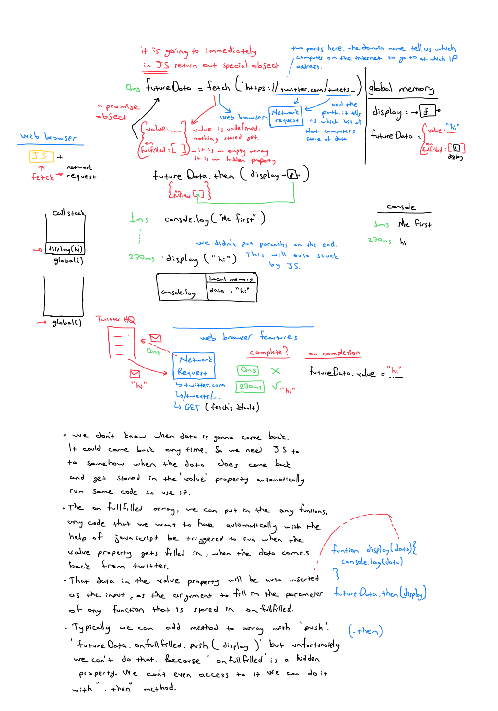
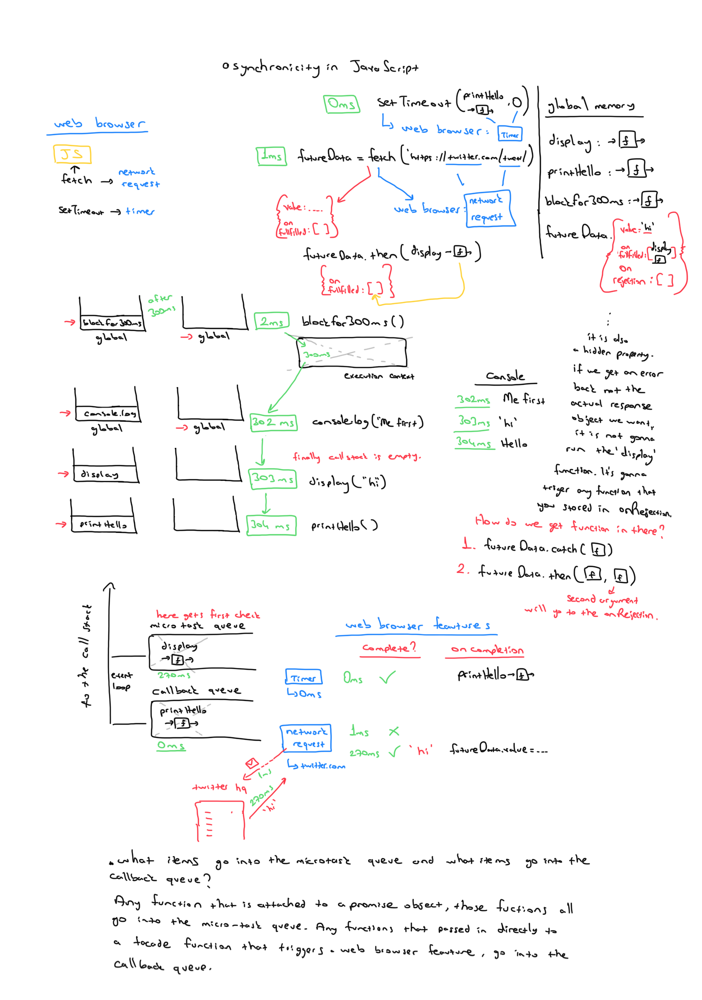

# Promises

Using two-pronged ‘facade’ functions that both:
`fetch` method do two things:

- Initiate background web browser work and
- Return a placeholder object (promise) immediately in JavaScript

## Example

```js
function display(data){
    console.log(data)
}
const futureData = fetch('https://twitter.com/will/tweets/1')
futureData.then(display);
console.log("Me first!");
```



Special objects built into JavaScript that get returned immediately when we make a call to a web browser API/feature (e.g. `fetch`) that’s set up to return promises.

Promises act as a placeholder for the data we expect to get back from the web browser feature’s background work.

Any code we want to run on the returned data must also be saved on the promise object.
Added using `.then` method to the hidden property `onFulfilment`.
Promise objects will automatically trigger the attached function to run with its input being the returned data.

## Example

```js
function display(data){console.log(data)}
function printHello(){console.log("Hello");}
function blockFor300ms() // blocks js thread for 300ms

setTimeout(printHello, 0);

const futureData = fetch('https://twitter.com/will/tweets/1')
futureData.then(display)

blockFor300ms()
console.log("Me first!");
```



**We have rules for the execution of our asynchronously delayed code**

- Hold promise-deferred functions in a microtask queue and callback function in a task queue (Callback queue) when the Web Browser Feature (API) finishes
- Add the function to the Call stack (i.e. run the function) when:
  - Call stack is empty & all global code run (Have the Event Loop check this condition)
- Prioritize functions in the microtask queue over the Callback queue

**Promises, Web APIs, the Callback & Microtask Queues and Event loop enable:**

- Non-blocking applications: This means we don’t have to wait in the single thread and don’t block further code from running
- However long it takes: We cannot predict when our Browser feature’s work will finish so we let JS handle automatically running the function on its completion
- Web applications: Asynchronous JavaScript is the backbone of the modern web - letting us build fast ‘non-blocking’ applications

## Resources:
* frontendmasters - JavaScript: The Hard Parts Will Sentance