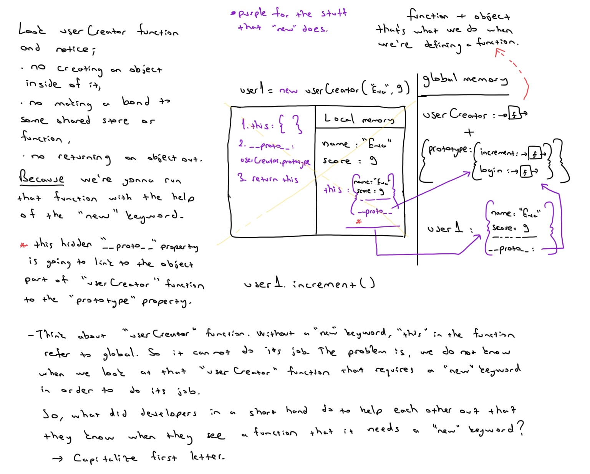

# Classes & Prototypes

**Classes, Prototypes - Object Oriented JavaScript**

- An enormously popular paradigm for structuring our complex code
- Prototype chain - the feature behind-the-scenes that enables emulation of OOP but is a compelling tool in itself
- Understanding the difference between `__proto__` and `prototype`
- The new and class keywords as tools to automate our object & method creation

So much data, so much functionality, hundreads lines of codes.. these things makes the code so complex. Finding the right functionality and making sure it only suplies to the right bit, we need some sort of organizing structure.

Your code could be easy to figure out what's going on. And also easy to add features to. That is new functionality for any given data. 

**Core of development (and running code)**

1. Save data (e.g. in a quiz game the scores of user1 and user2)
2. Run code (functions) using that data (e.g. increase user 2’s score)

Easy! So why is development hard?

In a quiz game I need to save lots of users, but also admins, quiz questions, quiz
outcomes, league tables - all have data and associated functionality

In 100,000 lines of code

- Where is the functionality when I need it?
- How do I make sure the functionality is only used on the right data!

**That is, I want my code to be:**

1. Easy to reason about But also
2. Easy to add features to (new functionality)
3. Nevertheless efficient and performant

The Object-oriented paradigm aims is to let us achieve these three goals

**So if I’m storing each user in my app with their respective data (let’s simplify)**

**User1:**
- name: "Tim"
- score: 3

**User2:**
- name: "Stephanie"
- score: 5

And the functionality I need to have for each user (again simplifying!) 
- increment functionality (there’d be a ton of functions in practice)

How could I store my data and functionality together in one place?

**Example**

```js
const user1 = {
  name: "Will",
  score: 3,
  increment: function() { user1.score++; }
};

user1.increment(); //user1.score -> 4

// Let's keep creating our objects. What alternative techniques do we have for creating objects?

const user2 = {}; //create an empty object

//assign properties to that object
user2.name = "Tim";
user2.score = 6;
user2.increment = function() {
  user2.score++;
};

//OR

//Object.create is going to give us fine-grained control over our object later on. It returns out an empty object

const user3 = Object.create(null);

 user3.name = "Eva";
 user3.score = 9;
 user3.increment = function() {
   user3.score++;
 };


//Our code is getting repetitive, we're breaking our DRY principle. And suppose we have millions of users! What could we do?
```

**Solution 1. Generate objects using a function**

```js
// Do NOT use this approach!!
function userCreator(name, score) {
  const newUser = {};
  newUser.name = name;
  newUser.score = score;
  newUser.increment = function() {
    newUser.score++;
  };
  return newUser;
};

const user1 = userCreator("Will", 3);
const user2 = userCreator("Tim", 5);
user1.increment()
```


**Problems:** Each time we create a new user we make space in our computer's memory for all our data and functions. But our functions are just copies

**Benefits:** It's simple and easy to reason about!

**Solution 2: Using the prototype chain**

Store the increment function in just one object and have the interpreter, if it doesn't find the function on `user1`, look up to that object to check if it's there.

Link user1 and `functionStore` so the interpreter, on not finding `.increment`, makes sure to check up in `functionStore` where it would find it

Make the link with `Object.create()` technique
 
 ```js
 function userCreator (name, score) {
  const newUser = Object.create(userFunctionStore);
  newUser.name = name;
  newUser.score = score;
  return newUser;
};

const userFunctionStore = {
  increment: function(){this.score++;},
  login: function(){console.log("Logged in");}
};

const user1 = userCreator("Will", 3);
const user2 = userCreator("Tim", 5);
user1.increment();

//What if we want to confirm our user1 has the property score

function userCreator (name, score) {
  const newUser = Object.create(userFunctionStore);
  newUser.name = name;
  newUser.score = score;
  return newUser;
};

const userFunctionStore = {
  increment: function(){this.score++;},
  login: function(){console.log("Logged in");}
};

const user1 = userCreator("Will", 3);
const user2 = userCreator("Tim", 5);
user1.hasOwnProperty('score')

//We can use the hasOwnProperty method - but where is it?
 ```


**What if we want to confirm our user1 has the property score**

- We can use the hasOwnProperty method - but where is it? Is it on user1?.
- All objects have a `__proto__` property by default which defaults to linking to a big object - Object.prototype full of (somewhat) useful functions.
- We get access to it via userFunctionStore’s `__proto__` property - the chain


**Create and invoke a new function (add1) inside increment**

```js
function userCreator(name, score) {
   const newUser = Object.create(userFunctionStore);
   newUser.name = name;
   newUser.score = score;
   return newUser;
};

const userFunctionStore = {
   increment: function() {
    function add1(){ this.score++; }
    add1() 
  }
};

const user1 = userCreator("Will", 3);
const user2 = userCreator("Tim", 5);
user1.increment();
```


**Arrow functions override the normal this rules**

```js
function userCreator(name, score) {
   const newUser = Object.create(userFunctionStore);
   newUser.name = name;
   newUser.score = score;
   return newUser;
};

const userFunctionStore = {
  increment: function() {
    const add1 = () => { this.score++; }
    add1() 
  }
};

const user1 = userCreator("Will", 3);
const user2 = userCreator("Tim", 5);
user1.increment();

//Now our inner function gets its this set by where it was saved - it’s a ‘lexically scoped this
```


**Solution 2: Using the prototype chain**

**Problems:** No problems! It's beautiful. Maybe a little long-winded.
.Write this every single time - but it's 6 words!

```js
const newUser = Object.create(userFunctionStore);

...

return newUser;
```

**Benefits:** Super sophisticated but not standard

**Solution 3 - Introducing the keyword that automates the hard work: `new`**

When we call the function that returns an object with new in front we automate 2 things

1. Create a new user object
2. Return the new user object 

```js
const user1 = new userCreator("Eva", 9)
const user2 = new userCreator("Tim", 5)
```

But now we need to adjust how we write the body of userCreator - how can we:

- Refer to the auto-created object?
- Know where to put our single copies of functions?


```js
 function multiplyBy2(num){
   return num*2
 }

 multiplyBy2.stored = 5

 multiplyBy2(3) // 6

 multiplyBy2.stored // 5

 multiplyBy2.prototype // {}

 //We could use the fact that all functions have a default property `prototype` on their object version, (itself an //object) - to replace our `functionStore` object
```


**The new keyword automates a lot of our manual work**

```js
function userCreator(name, score){
  this.name = name;
  this.score = score;
}

userCreator.prototype.increment = function(){ this.score++; };

userCreator.prototype.login = function(){ console.log("login"); };

const user1 = new userCreator(“Eva”, 9)

user1.increment()
```



**Benefits:** Faster to write. Often used in practice in professional code

**Problems:** 95% of developers have no idea how it works and therefore fail interviews.
We have to upper case first letter of the function so we know it requires ‘new’ to work!

**Solution 4: The class ‘syntactic sugar’**

- We’re writing our shared methods separately from our object `constructor` itself (off in the userCreator.prototype object )
- Other languages let us do this all in one place. ES2015 lets us do so too.

Syntactic sugar means something that changes the way it looks but it does not change it under the hood. When we declare a `class` we get a function + object combo.

```js
class UserCreator {
  constructor (name, score){
    this.name = name;
    this.score = score;
  }
  increment (){ this.score++; }
  login (){ console.log("login"); }
}

const user1 = new UserCreator("Eva", 9);
user1.increment();
```


## Resources:
* frontendmasters - JavaScript: The Hard Parts Will Sentance